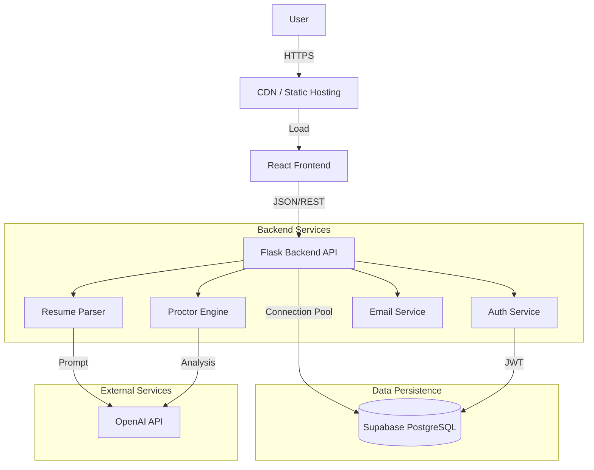

# System Architecture

## Overview

Cygnusa Elite Hire implements a modern, decoupled architecture separating the User Interface (React) from the Data & Logic Layer (Flask + PostgreSQL).

## 🏗️ High-Level Design

## 🔌 Backend Architecture

The backend is built with **Flask** and follows a modular service-oriented structure.

### Core Modules
- **`app.py`**: Application entry point, blueprint registration, and global error handling.
- **`db_config.py`**: Manages PostgreSQL database connections using a **Threaded Connection Pool** (`psycopg2.pool.SimpleConnectionPool`) for high-concurrency performance.
- **`db_helpers.py`**: Abstracted data access layer. Implements **LRU Caching** (`@lru_cache`) for frequent lookups (e.g., fetching user details by ID/Email) to minimize database hits.

### Performance Optimizations (v2.0)
The system currently includes several performance enhancements:
1.  **Connection Pooling**: Reuses database connections instead of creating new ones per request (5-10 connections/pool).
2.  **Query Optimization**: Uses correlated subqueries in Admin/Proctor dashboards to reduce round-trips (N+1 problem elimination).
3.  **Caching**: In-memory caching for static configurations and user profiles.
4.  **Efficient String Building**: List-join patterns for text generation.

### AI Integration
- **Resume Analysis**: Uses OpenAI to structure unstructured resume text into JSON format for scoring.
- **Question Generation**: Generates context-aware questions based on the intersection of Job Description and Candidate Resume.

## 💻 Frontend Architecture

The frontend is a Single Page Application (SPA) built with **React** and **Vite**.

- **Routing**: `react-router-dom` for client-side navigation.
- **Styling**: `Tailwind CSS` for utility-first responsive design.
- **State Management**: React Context API (`AuthContext`) for global user state.
- **Real-time**: WebSockets (if applicable) or Polling for proctoring status updates.

## 🔒 Security

- **Authentication**: JWT (JSON Web Tokens) with expiration.
- **Password Storage**: Secure hashing using `werkzeug.security`.
- **RBAC**: Middleware enforces role checks (`admin`, `interviewer`, `proctor`, `candidate`) on protected routes.
- **Data Protection**: Input validation and parameterized SQL queries to prevent Injection attacks.
