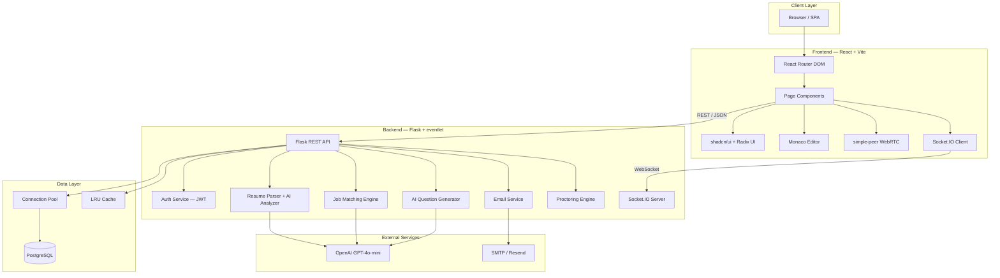
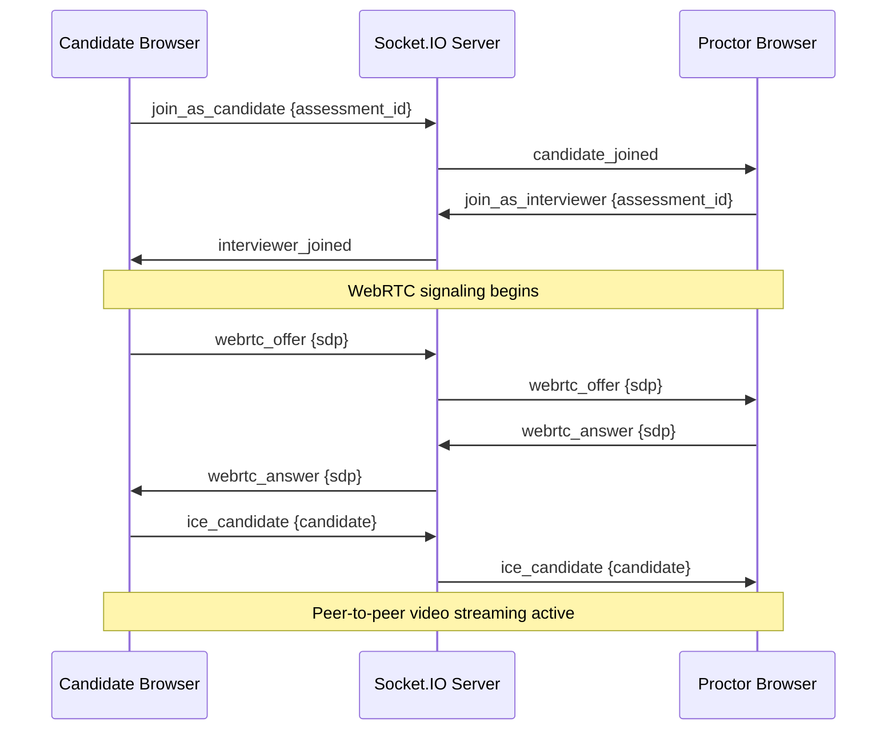
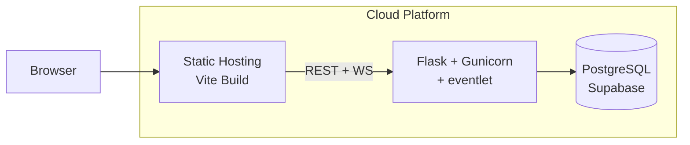

# System architecture

This document describes the architecture, design decisions, and key
components of the Cygnusa Elite Hire platform.

## High-level design

Cygnusa Elite Hire uses a decoupled architecture separating the user
interface (React SPA) from the data and logic layer (Flask REST API +
PostgreSQL). Real-time proctoring uses Socket.IO for WebRTC signaling
alongside the REST API.



## Backend architecture

The backend is built with Flask and follows a modular, service-oriented
structure. Each domain has its own blueprint registered on the main
application.

### Module overview

| Module | Responsibility |
|--------|---------------|
| `app.py` | Application entry point, blueprint registration, global error handling, root routes |
| `auth.py` | User registration, login, JWT token management |
| `admin_routes.py` | Admin dashboard API — user/candidate management, analytics, bulk operations |
| `interviewer_routes.py` | Interviewer dashboard API — candidate review, scheduling, decisions |
| `interviewee_routes.py` | Candidate assessment API — token access, answer submission, scoring |
| `proctor_routes.py` | Proctoring API — session monitoring, violation tracking |
| `job_routes.py` | Job postings, sectors, AI candidate-job matching, audit logs |
| `db_config.py` | PostgreSQL connection pool management |
| `db_helpers.py` | Data access layer with LRU caching |
| `resume_parser.py` | PDF/DOCX text extraction and basic skill matching |
| `resume_analyzer.py` | AI-powered resume evaluation (pros/cons, recommendations) |
| `job_matcher.py` | Rule-based + AI candidate-job matching |
| `ai_question_generator.py` | AI-generated MCQs, coding problems, and test cases |
| `questions_bank.py` | Static fallback question repository |
| `email_service.py` | Dual-transport email delivery (Resend API + SMTP) |
| `websocket_server.py` | Socket.IO server for WebRTC signaling |
| `rate_limiter.py` | Per-endpoint request rate limiting |
| `security_headers.py` | HTTP security header middleware |
| `request_logger.py` | Request logging with timing and user tracking |

### Blueprint registration

```
/api/auth          → auth_bp
/api/admin         → admin_bp
/api/interviewer   → interviewer_bp
/api/interviewee   → interviewee_bp
/api/proctor       → proctor_bp
/api/jobs          → jobs_bp
```

### Performance optimizations

The backend includes several optimizations for production workloads:

- **Connection pooling** — `psycopg2.pool.SimpleConnectionPool` reuses
  database connections (5-10 per pool) instead of creating new ones per
  request.
- **Query optimization** — Correlated subqueries in dashboard endpoints
  eliminate N+1 query patterns.
- **LRU caching** — `@lru_cache` on frequently accessed lookups (user
  profiles, static configurations) to reduce database round-trips.
- **Efficient string building** — List-join patterns for text generation
  instead of string concatenation.

### AI integration

Three modules use OpenAI GPT-4o-mini:

1. **Resume Analyzer** — Evaluates candidate resumes against job
   requirements. Generates structured analysis with pros, cons,
   recommendation tier, and confidence score. Falls back to rule-based
   analysis when the API is unavailable.

2. **Job Matcher** — Computes rule-based skill and experience match scores,
   then uses AI to re-rank the top 5 matches with reasoning.

3. **Question Generator** — Produces personalized MCQs, coding problems
   with test cases, and psychometric scenarios based on the intersection
   of a candidate's skills and the job description. Supports custom
   question bank injection.

## Frontend architecture

The frontend is a single-page application built with React 18 and Vite 5.

### Routing structure

| Route | Page | Access |
|-------|------|--------|
| `/` | Landing page | Public |
| `/login` | Login | Public |
| `/jobs` | Job listings | Public |
| `/apply/:jobId` | Application form | Public |
| `/assessment/:token` | Assessment interface | Token-based |
| `/interviewer` | Interviewer dashboard | JWT (interviewer) |
| `/admin` | Admin dashboard | JWT (admin) |
| `/proctor` | Proctor dashboard | JWT (proctor) |
| `/forbidden` | 403 error page | Public |
| `/500` | Server error page | Public |
| `*` | 404 not found | Public |

### Component organization

```
src/
├── pages/               # Route-level page components
├── components/
│   ├── ui/              # shadcn/ui primitives (button, card, dialog, etc.)
│   └── common/          # Shared application components
├── services/            # API client (Axios)
├── hooks/               # Custom hooks (toast, proctoring, realtime)
├── context/             # React Context providers (theme)
├── config/              # Supabase client configuration
├── lib/                 # Utility functions
└── theme/               # Theme configuration
```

### Key patterns

- **State management** — React Context API for global state (auth, theme).
  Component-level state for local concerns.
- **Data fetching** — Axios-based API client with automatic base URL
  detection for localhost and network environments.
- **Component library** — Radix UI primitives wrapped with Tailwind CSS
  via shadcn/ui for accessible, consistent UI components.
- **Code editor** — Monaco Editor integration for the coding assessment
  section with multi-language support.
- **Real-time proctoring** — Socket.IO client + simple-peer for WebRTC
  video streaming from candidate to proctor.

## Security architecture

### Authentication

- JWT tokens with 24-hour expiry issued at login
- Automatic error handlers for expired and invalid tokens
- Token verification endpoint for frontend session validation

### Authorization

- Role-based access control (RBAC) with five hierarchical roles
- Middleware enforces minimum role level per endpoint
- Sector-scoped permissions for sector admins

### Data protection

- Parameterized SQL queries prevent injection attacks
- Input validation with RFC 5322 email verification
- Secure filename sanitization (werkzeug)
- 10 MB file upload size limit
- Password hashing with bcrypt

### HTTP hardening

- Content-Security-Policy
- X-Frame-Options: DENY
- X-Content-Type-Options: nosniff
- X-XSS-Protection
- Referrer-Policy: strict-origin-when-cross-origin
- Permissions-Policy (camera, microphone, geolocation)

### Rate limiting

| Endpoint | Limit |
|----------|-------|
| Default | 200 requests/day |
| Login | 10 requests/minute |
| Registration | 5 requests/minute |
| File upload | 10 requests/hour |

## Real-time architecture

The proctoring system uses a room-based WebSocket architecture for
real-time communication.



Each assessment runs in an isolated Socket.IO room. The server relays
WebRTC signaling messages and tracks peer connections. Automatic cleanup
runs when participants disconnect.

## Deployment architecture



- **Backend** — Gunicorn WSGI server with eventlet worker class for
  WebSocket support. Configured via `Procfile` and `nixpacks.toml`.
- **Frontend** — Static files served from `frontend/dist/` after
  `npm run build`.
- **Database** — PostgreSQL with connection pooling tuned for Supabase
  free-tier limits (2-5 connections).
