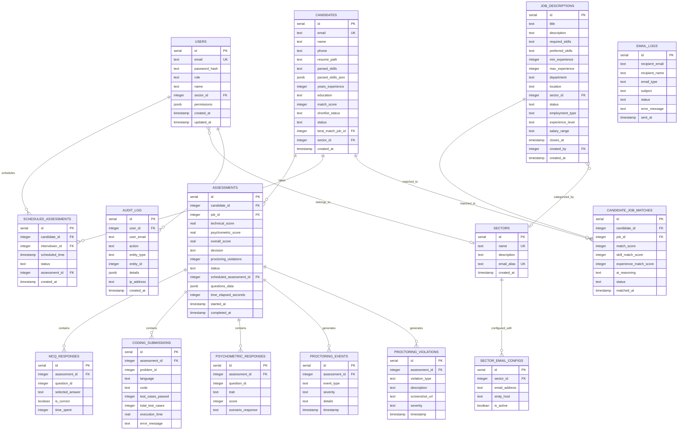

# Database schema

This document describes the PostgreSQL database schema used by HireSense,
including all tables, relationships, indexes, and migrations.

> **Naming note:** The database table is called `job_descriptions` for historical reasons.
> The API routes, UI, and documentation all refer to these records as **job postings**.
> A future migration should rename the table to `job_postings` for consistency.
> Until then, treat `job_descriptions` and "job postings" as the same concept.

## Entity-relationship diagram



## Tables reference

### `users`

System users with dashboard access. The `role` field determines
permissions within the RBAC hierarchy.

| Column | Type | Description |
|--------|------|-------------|
| `id` | serial | Primary key |
| `email` | text | Unique login email |
| `password_hash` | text | bcrypt hash |
| `role` | text | `super_admin`, `sector_admin`, `recruiter`, `interviewer`, `proctor` |
| `name` | text | Display name |
| `sector_id` | integer | FK to `sectors` (nullable) |
| `permissions` | jsonb | Additional permission flags |

### `candidates`

Applicants who have submitted resumes through the platform.

| Column | Type | Description |
|--------|------|-------------|
| `id` | serial | Primary key |
| `email` | text | Unique candidate email |
| `name` | text | Full name |
| `phone` | text | Contact number |
| `resume_path` | text | Path to uploaded resume file |
| `parsed_skills` | text | JSON array of extracted skills |
| `parsed_skills_json` | jsonb | Structured skills data |
| `years_experience` | integer | Extracted years of experience |
| `education` | text | Education level |
| `match_score` | integer | AI-computed match score (0-100) |
| `shortlist_status` | text | `High Match`, `Potential`, `Reject` |
| `status` | text | Pipeline stage (`pending`, `shortlisted`, `assessment_scheduled`, etc.) |
| `best_match_job_id` | integer | FK to best-matching job posting |

### `sectors`

Organizational divisions for sector-scoped access control.

| Column | Type | Description |
|--------|------|-------------|
| `id` | serial | Primary key |
| `name` | text | Unique sector name |
| `description` | text | Sector description |
| `email_alias` | text | Sector email address |

### `job_descriptions`

Job postings with requirements, skills, and metadata.

| Column | Type | Description |
|--------|------|-------------|
| `id` | serial | Primary key |
| `title` | text | Job title |
| `description` | text | Full description |
| `required_skills` | text | JSON array of required skills |
| `preferred_skills` | text | JSON array of preferred skills |
| `min_experience` | integer | Minimum years of experience |
| `max_experience` | integer | Maximum years of experience |
| `department` | text | Department name |
| `location` | text | Job location |
| `sector_id` | integer | FK to `sectors` |
| `status` | text | `active`, `closed`, `draft` |
| `employment_type` | text | `full-time`, `part-time`, `contract` |
| `experience_level` | text | `junior`, `mid`, `senior`, `lead`, `principal` |
| `salary_range` | text | Salary information |
| `closes_at` | timestamp | Application deadline |
| `created_by` | integer | FK to `users` |

### `scheduled_assessments`

Assessment scheduling records linking candidates, interviewers, and time
windows.

| Column | Type | Description |
|--------|------|-------------|
| `id` | serial | Primary key |
| `candidate_id` | integer | FK to `candidates` |
| `interviewer_id` | integer | FK to `users` |
| `scheduled_time` | timestamp | Scheduled start time |
| `status` | text | `scheduled`, `in_progress`, `completed`, `cancelled` |
| `assessment_id` | integer | FK to `assessments` (set after start) |

### `assessments`

Active and completed assessment sessions with scores and metadata.

| Column | Type | Description |
|--------|------|-------------|
| `id` | serial | Primary key |
| `candidate_id` | integer | FK to `candidates` |
| `job_id` | integer | FK to `job_descriptions` |
| `technical_score` | real | MCQ + coding combined score (0-100) |
| `psychometric_score` | real | Psychometric evaluation score (0-100) |
| `overall_score` | real | Weighted average of all scores |
| `decision` | text | `Hire`, `No-Hire`, `Maybe` |
| `proctoring_violations` | integer | Total violation count |
| `status` | text | `in_progress`, `completed` |
| `questions_data` | jsonb | Generated MCQ, coding, and psychometric questions |
| `time_elapsed_seconds` | integer | Elapsed time for resume support |
| `started_at` | timestamp | Assessment start time |
| `completed_at` | timestamp | Assessment completion time |

### `mcq_responses`

Individual MCQ answer records.

| Column | Type | Description |
|--------|------|-------------|
| `assessment_id` | integer | FK to `assessments` |
| `question_id` | integer | Question identifier |
| `selected_answer` | text | `A`, `B`, `C`, or `D` |
| `is_correct` | boolean | Whether the answer is correct |
| `time_spent` | integer | Seconds spent on the question |

### `coding_submissions`

Code submissions for coding challenges.

| Column | Type | Description |
|--------|------|-------------|
| `assessment_id` | integer | FK to `assessments` |
| `problem_id` | integer | Problem identifier |
| `language` | text | `python`, `javascript`, or `java` |
| `code` | text | Submitted code |
| `test_cases_passed` | integer | Passing test count |
| `total_test_cases` | integer | Total test count |

### `psychometric_responses`

Psychometric scenario evaluation responses.

| Column | Type | Description |
|--------|------|-------------|
| `assessment_id` | integer | FK to `assessments` |
| `question_id` | integer | Scenario identifier |
| `trait` | text | Evaluated trait (leadership, teamwork, etc.) |
| `score` | integer | Score (1-10) |
| `scenario_response` | text | Selected response |

### `proctoring_events`

Detected suspicious activities during assessments.

| Column | Type | Description |
|--------|------|-------------|
| `assessment_id` | integer | FK to `assessments` |
| `event_type` | text | `multiple_faces`, `no_face`, `tab_switch`, `copy_paste` |
| `severity` | text | `low`, `medium`, `high` |
| `details` | text | Additional context |

### `proctoring_violations`

Recorded violations with optional screenshot evidence.

| Column | Type | Description |
|--------|------|-------------|
| `assessment_id` | integer | FK to `assessments` |
| `violation_type` | text | Type of violation |
| `description` | text | Violation description |
| `screenshot_url` | text | URL to screenshot evidence |
| `severity` | text | `low`, `medium`, `high` |

### `email_logs`

Audit trail of all system-sent emails.

| Column | Type | Description |
|--------|------|-------------|
| `recipient_email` | text | Recipient address |
| `recipient_name` | text | Recipient name |
| `email_type` | text | `rejection`, `assessment_invitation`, `final_decision` |
| `subject` | text | Email subject line |
| `status` | text | `sent`, `failed`, `bounced` |
| `error_message` | text | Error details if failed |

### `candidate_job_matches`

AI-computed candidate-to-job match records.

| Column | Type | Description |
|--------|------|-------------|
| `candidate_id` | integer | FK to `candidates` |
| `job_id` | integer | FK to `job_descriptions` |
| `match_score` | integer | Overall match (0-100) |
| `skill_match_score` | integer | Skill overlap score (0-100) |
| `experience_match_score` | integer | Experience fit score (0-100) |
| `ai_reasoning` | text | AI explanation of the match |
| `status` | text | `auto_matched`, `confirmed`, `rejected` |

### `audit_log`

Compliance audit trail for all user actions.

| Column | Type | Description |
|--------|------|-------------|
| `user_id` | integer | FK to `users` |
| `user_email` | text | Email at time of action |
| `action` | text | Action type (for example, `create_job`, `match_candidate`) |
| `entity_type` | text | Target entity (for example, `job_posting`, `candidate`) |
| `entity_id` | integer | Target entity ID |
| `details` | jsonb | Additional context |
| `ip_address` | text | Client IP address |

## Indexes

The schema includes indexes for query performance:

| Table | Index | Columns |
|-------|-------|---------|
| `users` | `idx_users_email` | `email` |
| `users` | `idx_users_role` | `role` |
| `users` | `idx_users_sector` | `sector_id` |
| `candidates` | `idx_candidates_email` | `email` |
| `candidates` | `idx_candidates_status` | `shortlist_status` |
| `candidates` | `idx_candidates_best_job` | `best_match_job_id` |
| `candidates` | `idx_candidates_sector` | `sector_id` |
| `assessments` | `idx_assessments_candidate` | `candidate_id` |
| `assessments` | `idx_assessments_status` | `status` |
| `scheduled_assessments` | `idx_scheduled_assessments_candidate` | `candidate_id` |
| `scheduled_assessments` | `idx_scheduled_assessments_time` | `scheduled_time` |
| `job_descriptions` | `idx_job_descriptions_sector` | `sector_id` |
| `job_descriptions` | `idx_job_descriptions_status` | `status` |
| `job_descriptions` | `idx_job_descriptions_level` | `experience_level` |
| `candidate_job_matches` | `idx_candidate_job_matches_score` | `match_score DESC` |
| `audit_log` | `idx_audit_log_created` | `created_at DESC` |
| `email_logs` | `idx_email_logs_recipient` | `recipient_email` |
| `email_logs` | `idx_email_logs_type` | `email_type` |

## Migrations

Database migrations are stored in `database/migrations/` and are applied
incrementally after the base schema.

| Migration | Description |
|-----------|------------|
| `add_assessment_token.sql` | Adds token-based assessment access links |
| `add_job_postings_sectors_rbac.sql` | Adds sectors, RBAC extensions, job posting fields, candidate-job matching, and audit logging |

Apply migrations in order:

```bash
psql "$DATABASE_URL" -f database/migrations/add_assessment_token.sql
psql "$DATABASE_URL" -f database/migrations/add_job_postings_sectors_rbac.sql
```

## Schema files

| File | Description |
|------|-------------|
| `database/schema_postgresql.sql` | Full base schema (recommended for new installations) |
| `database/schema.sql` | SQLite-compatible schema (legacy) |
| `backend/schema_postgres.sql` | Backend copy of the PostgreSQL schema |
