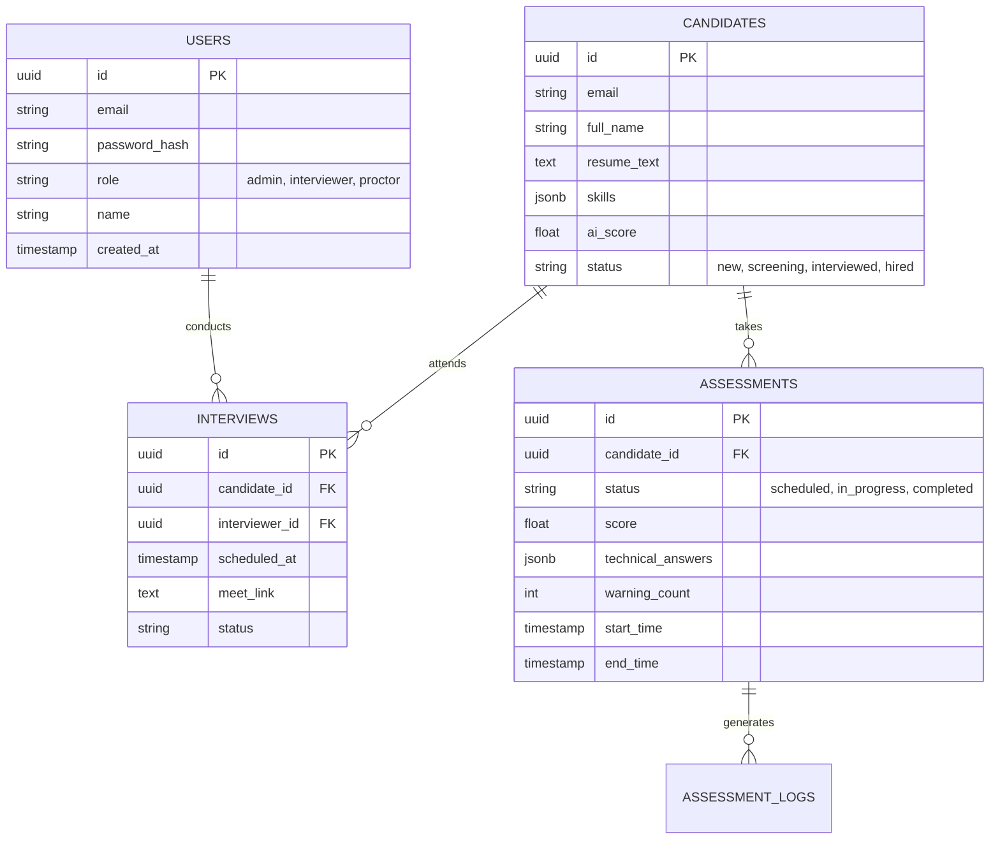

# Database Schema

The application uses **PostgreSQL** with the following schema structure.

## 📊 Entity Relationship Diagram

## 🗄️ Tables Reference

### `users`
System users with access to dashboards.
- **role**: Determines access level (`admin`, `interviewer`, `proctor`).

### `candidates`
Applicants who have submitted their resumes.
- **resume_text**: Full text extracted from PDF/DOCX.
- **ai_score**: Initial ranking score (0-100) based on resume analysis.

### `assessments`
Technical tests taken by candidates.
- **warning_count**: Number of proctoring flags (e.g., Tab focus lost).
- **technical_answers**: JSON object storing question-answer pairs.

### `email_logs`
Audit log of all system-sent emails.
- **status**: `sent`, `failed`.
- **metadata**: API response from email provider.
